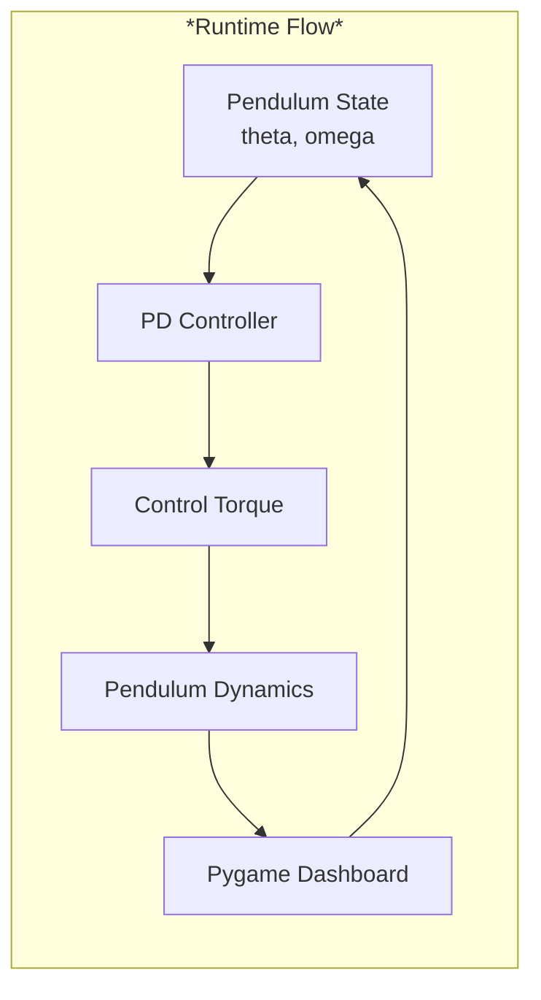
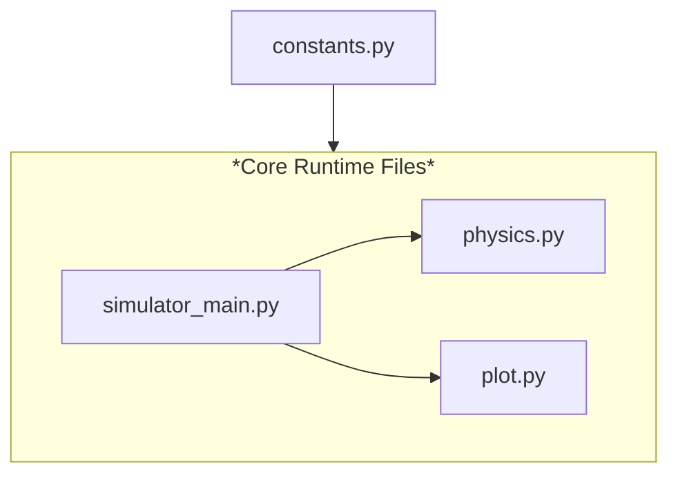
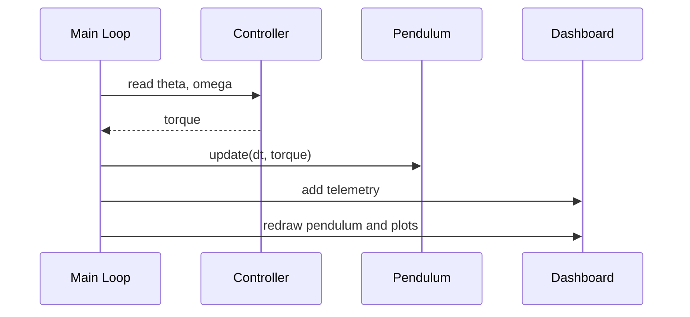

# Rotary Inverted Pendulum Simulator

A compact real-time **Python-based** pendulum control demo.

---

## Overview


---
#### Quick Start

```bash
pip install pygame numpy
python simulator/simulator_main.py
```

---

#### File Map (codebase organization)




| File | Role |
| --- | --- |
| `simulator/constants.py` | Centralizes physics, controller, simulation, and angle constants |
| `simulator/simulator_main.py` | Creates the window, runs the loop, updates plots, and wires controller output into the plant |
| `simulator/physics.py` | Defines `Pendulum` and `Controller` |
| `simulator/plot.py` | Draws the pendulum, torque arc, and scrolling telemetry charts |

---

## Simulation Setup

| Parameter | Value |
| --- | --- |
| Length | `1.0 m` |
| Mass | `1.0 kg` |
| Gravity | `9.81 m/s^2` |
| Damping | `0.75` |
| Initial angle | `-pi / 4` |
| Initial angular velocity | `0.0 rad/s` |
| Max torque | `10.0 N·m` |

##### _Edit [simulator/constants.py](simulator/constants.py) to change:_
```
- pendulum parameters
- controller gains
- simulation timing
- angle conventions and torque limits
```
---

## Runtime Loop



Each frame:
1. the controller computes torque toward the upright target,
2. the pendulum state is advanced using `dt`,
3. angle, velocity, torque, and error are pushed into live plots,
4. the dashboard is redrawn.

## Tunable Constants

| Constant group | Examples |
| --- | --- |
| Pendulum | `PENDULUM_LENGTH_METERS`, `PENDULUM_MASS_KG`, `PENDULUM_DAMPING_COEFFICIENT` |
| Controller | `KP`, `KD`, `MAX_ALLOWABLE_TORQUE` |
| Simulation | `SIMULATION_FPS`, `TIME_RESOLUTION` |
